# Challenge Academia For IT

Decidí realizar la prueba en Next.js porque me parece más eficiente tener el backend y el frontend en un mismo proyecto. Además, utilicé varias librerías para mejorar la experiencia tanto del usuario como del desarrollador.

## Tecnologías y Librerías Utilizadas

- **Next.js**: Framework principal para frontend y backend.
- **Fuse.js**: Para la funcionalidad de búsqueda.
- **SweetAlert**: Para mostrar alertas al usuario al crear, editar o eliminar tareas.
- **Zustand**: Para el manejo del estado global de la aplicación.
- **Formik & Yup**: Para el envío y validación de formularios.
- **UUID**: Para la creación de IDs únicos.
- **Iconify**: Para la importación de iconos.
- **TailwindCSS**: Para los estilos de la página.

## Pasos para probar el proyecto

1. **Clonar el repositorio:**
   git clone https://github.com/JeronimoCortez/Challenge-for-it.git

2. **Instalar dependencias:**
   npm install

3. **Levantar el servidor de desarrollo:**
   npm run dev

4. **Abrir en el navegador:**  
   Ingresar a [http://localhost:3000](http://localhost:3000) para ver la aplicación funcionando.

A continuación, se adjuntan imágenes del proyecto en funcionamiento.

**Página principal**  
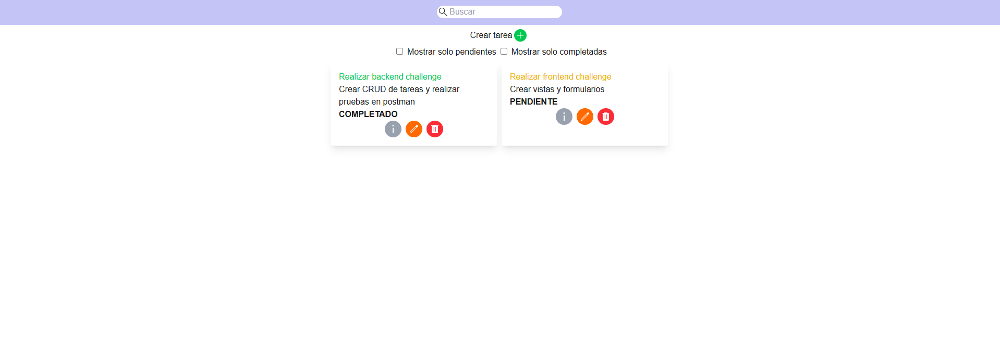

**Vemos info de una tarea**  
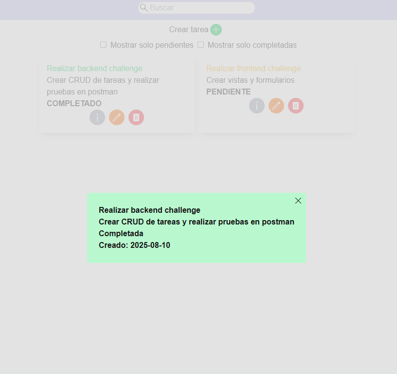

**Editamos una tarea**  
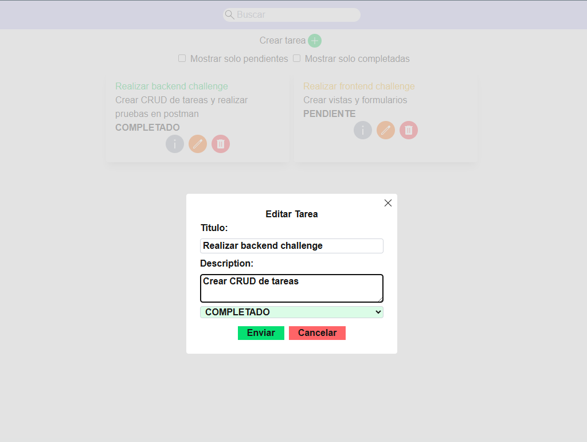
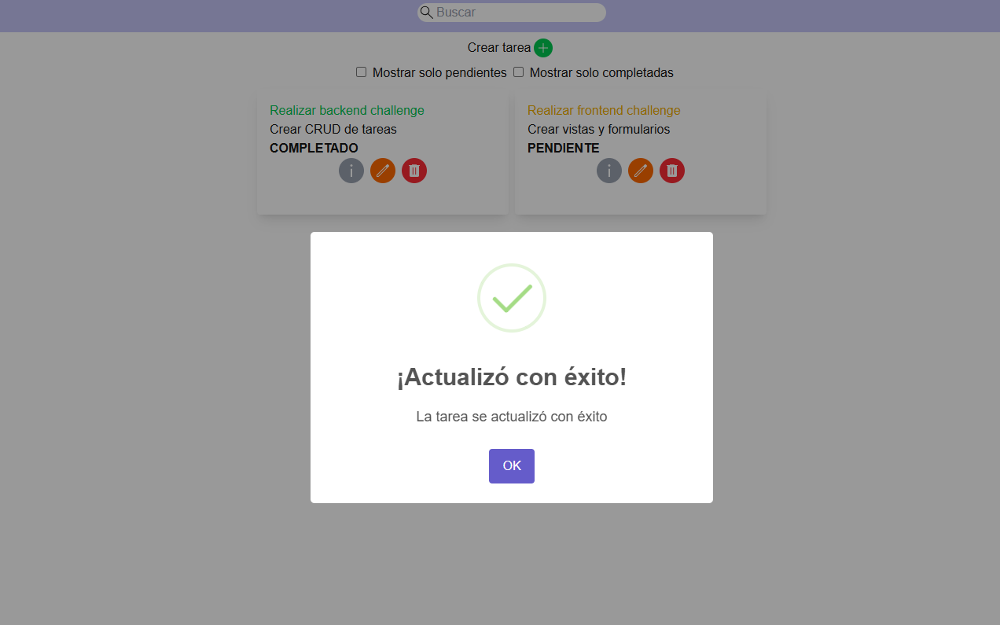

**Creamos una tarea**  
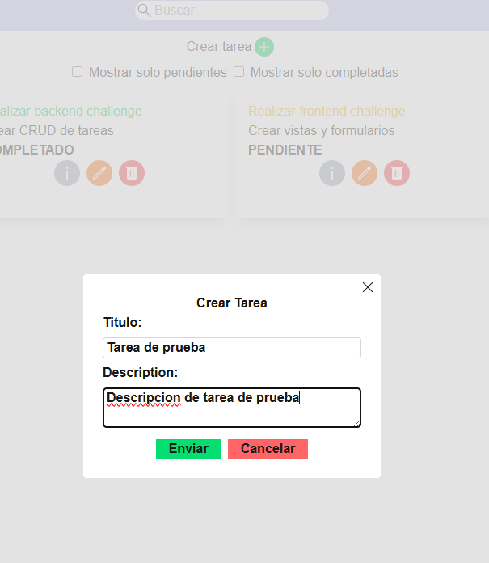
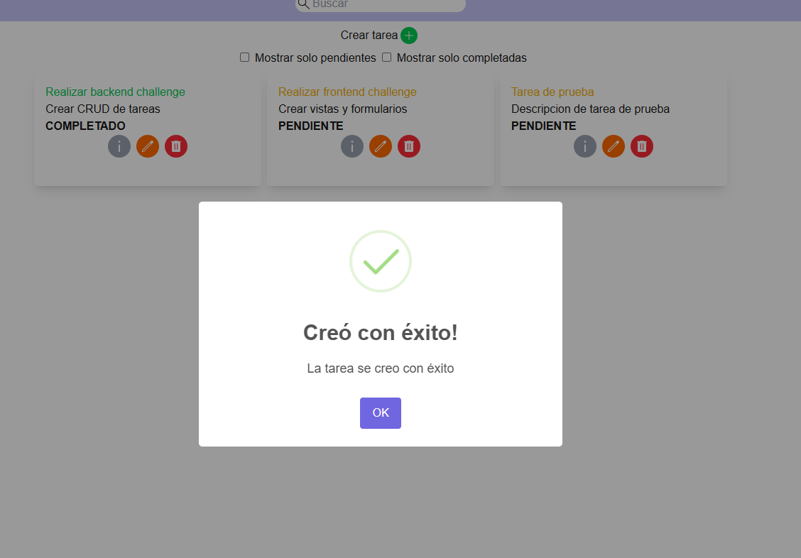
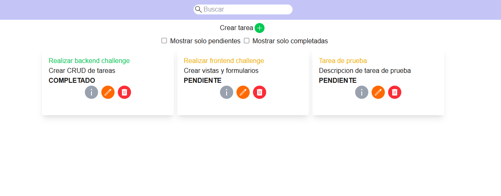

**Filtro solo tareas completadas**  
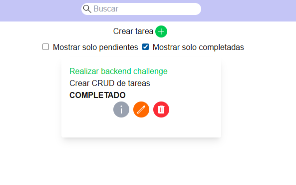

**Filtro solo tareas pendientes**  
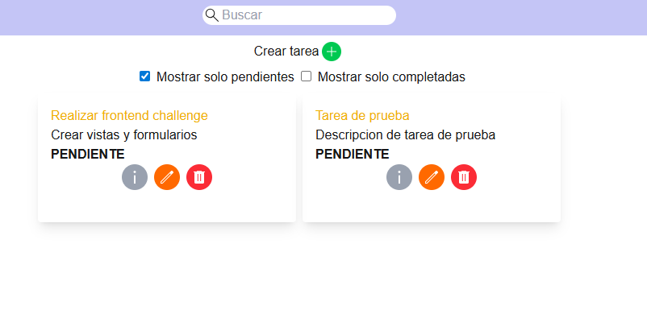

**Eliminamos una tarea**  
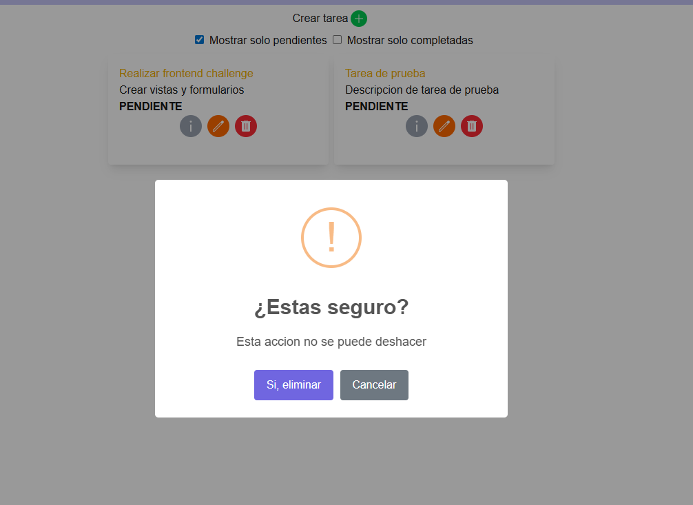
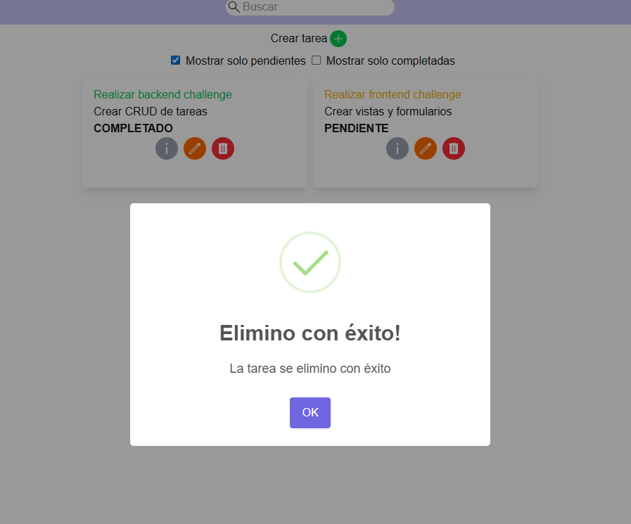
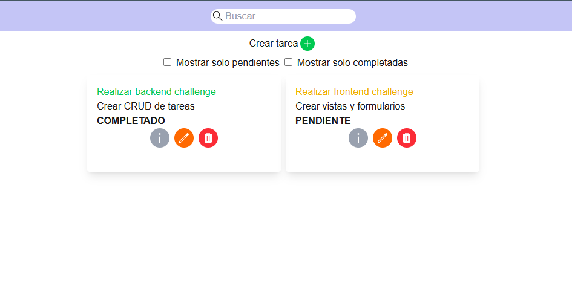

**Buscamos una tarea**  
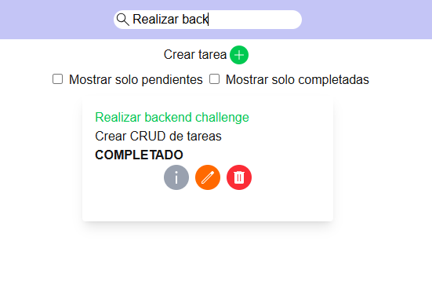
